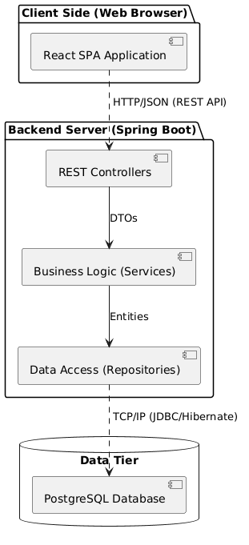
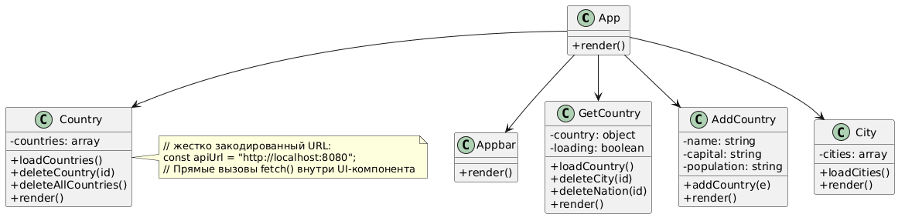

# Отчет по лабораторной работе №3

**Тема:** Исследование архитектурного решения  
**Проект:** Country Exploration System (Управление данными о странах, городах и нациях)

---

## Часть 1. Проектирование архитектуры (To Be)

На этапе проектирования определена целевая архитектура системы, ориентированная на четкое разделение ответственности, простоту поддержки и возможность независимого масштабирования.

### 1. Тип приложения
Система представляет собой **многоуровневое веб-приложение (Rich Internet Application)**, построенное по принципу клиент-серверной архитектуры.
*   **Клиентская часть (Frontend):** Single Page Application (SPA) на базе библиотеки React.
*   **Серверная часть (Backend):** RESTful API на базе фреймворка Spring Boot.

### 2. Стратегия развертывания (Распределенная N-Tier модель)
Проект спроектирован как распределенная система, где логические слои физически разнесены по разным узлам:
*   **Звено представления (Presentation Tier - Frontend):** Статические файлы (HTML, CSS, JS), которые могут раздаваться через web-сервер (например, Nginx) или CDN. Клиент выполняется непосредственно в браузере пользователя.
*   **Звено бизнес-логики (Application Tier - Backend):** Java/Spring Boot приложение. Физически работает как отдельный процесс (например, в Docker-контейнере), обрабатывая входящие HTTP/REST запросы от фронтенда.
*   **Звено данных (Data Tier - Database):** СУБД PostgreSQL. Физически изолированный сервер баз данных, отвечающий за надежное хранение информации и обеспечение транзакционности.

### 3. Обоснование выбора технологий
*   **Java 8+ & Spring Boot (Backend):** Обеспечивает строгую типизацию, высокую производительность и содержит мощную экосистему (Spring Data, Spring Web) для быстрой разработки надежных REST API.
*   **Spring Data JPA & Hibernate:** ORM-решение, которое абстрагирует работу с SQL, позволяя разработчику оперировать Java-объектами (Entity) и автоматически генерировать оптимальные запросы к БД.
*   **PostgreSQL:** Мощная реляционная СУБД с открытым исходным кодом, отлично подходящая для хранения связанных данных (страны, города, нации) благодаря строгой проверке целостности внешних ключей (Foreign Keys).
*   **React & React Router v6 (Frontend):** Компонентный подход React позволяет переиспользовать элементы UI, а React Router обеспечивает мгновенную навигацию без перезагрузки страницы.
*   **Bootstrap & Material-UI (MUI):** Использование готовых UI-библиотек ускоряет разработку интерфейса и обеспечивает адаптивность (responsive design) из коробки.
*   **Swagger:** Автоматизированная генерация документации для API, выступающая "контрактом" между фронтенд и бэкенд разработчиками.

### 4. Показатели качества
*   **Масштабируемость (Scalability):** Бэкенд реализован как *stateless* REST API. Это позволяет легко балансировать нагрузку, запуская несколько экземпляров Spring Boot приложения.
*   **Сопровождаемость (Maintainability):** Строгое разделение на Backend и Frontend. Внутри бэкенда используется классическая трехслойная архитектура (Controller -> Service -> Repository).
*   **Отзывчивость интерфейса (Usability):** Благодаря SPA подходу (React) и асинхронным запросам (`fetch`), пользовательский опыт остается плавным.

### 5. Пути реализации сквозной функциональности
*   **Маршрутизация (Routing):** Реализована на обеих сторонах. На фронтенде - React Router для смены экранов. На бэкенде - аннотации Spring (`@RestController`, `@GetMapping` и т.д.) для маппинга URL на методы.
*   **Обработка данных (CORS & JSON):** Настроена политика CORS на стороне Spring Boot для разрешения запросов с домена фронтенда. Данные передаются исключительно в формате JSON.
*   **Обработка ошибок:** Механизмы `try-catch` на клиенте и глобальные перехватчики исключений (Global Exception Handling) на стороне сервера.

### 6. Структурная схема приложения (To Be)
 

---

## Часть 2. Анализ архитектуры (As Is)

На основе проанализированного реального кода фронтенда (React) построена диаграмма классов и компонентов "As Is".
Текущая архитектура демонстрирует жесткую привязку компонентов представления к логике получения данных.

### Диаграмма классов/компонентов Frontend (As Is)
 

---

## Часть 3. Сравнение и рефакторинг

### 1. Сравнение архитектур "As is" и "To be"
В целевой архитектуре предполагается полная независимость слоев. Однако в текущей реализации (As is) клиентской части выявлено сильное зацепление (High Coupling) бизнес-логики (API запросы) и логики представления (UI).

**Отличия:**
*   **Управление API-запросами:** В коде "As is" константа `const apiUrl = "http://localhost:8080";` и прямые вызовы `fetch()` дублируются в каждом файле (`AddCity.js`, `EditCountry.js`, `GetNation.js` и т.д.). В "To be" архитектуре предполагается наличие единого шлюза/сервиса для работы с API.
*   **Управление состоянием (State Management):** В "As is" состояние разрознено и хранится локально в компонентах (через `useState`). Нет единого кэша данных.
*   **Обработка конфигурации:** URL сервера "захардкожен". При развертывании в облаке (production) придется переписывать код.

### 2. Анализ причин отличий
*   **Скорость разработки (MVP):** Прототипирование на ранних этапах (Sprint 1) требует быстрого создания работоспособного продукта. Размещение запросов прямо в компонентах ускоряет первичную сборку интерфейса.
*   **Отсутствие инфраструктурного кода:** Не было выделено времени на настройку HTTP-клиента (например, Axios) и глобальных конфигураций.

### 3. Пути улучшения архитектуры (Рефакторинг)

Руководствуясь принципами проектирования **SOLID** (в частности, Single Responsibility Principle) и паттерном **Facade / API Gateway**, предлагаются следующие шаги:

1.  **Паттерн "Service/API Client" (Слой абстракции для сети):**
    *   Создать отдельную директорию `src/services/`.
    *   Вынести все методы работы с сетью (`fetch`) в отдельные файлы, например `api/countryService.js`, `api/cityService.js`.
    *   *Преимущество:* Компоненты React (`Country.js`, `AddCity.js`) будут только вызывать методы (например, `CountryService.getAll()`) и отображать данные, не зная о том, как устроен HTTP запрос, какие заголовки передаются и как парсится JSON.

2.  **Использование Environment Variables (Переменные окружения):**
    *   Убрать `const apiUrl = "http://localhost:8080";` из всех файлов.
    *   Создать файл `.env` с переменной `REACT_APP_API_URL=http://localhost:8080`.
    *   *Преимущество:* Архитектура станет переносимой (Portable). Можно легко переключаться между `localhost` и реальным сервером (production).

3.  **Переход на Axios (или React Query):**
    *   Заменить нативные `fetch()` на `axios`. Это позволит настроить интерцепторы (interceptors) для глобальной обработки ошибок (например, перехватывать 500 ошибку и показывать красивый Toast-уведомление пользователю, а не писать `try-catch` в каждом компоненте).
    *   *Преимущество:* Уменьшение дублирования кода (DRY - Don't Repeat Yourself), улучшение надежности.