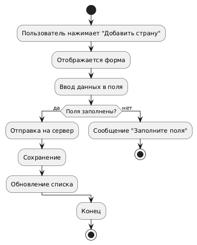
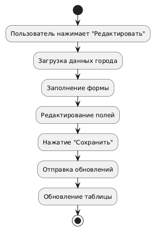
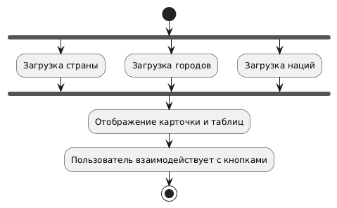

# 📊 Диаграммы активностей — CountrySearch

## 📑 Содержание

1. [Добавление страны](#1)
2. [Редактирование города](#2)
3. [Просмотр деталей страны](#3)

---

### 1. Добавление страны

---

### 2. Редактирование города

---

### 3. Просмотр деталей страны

