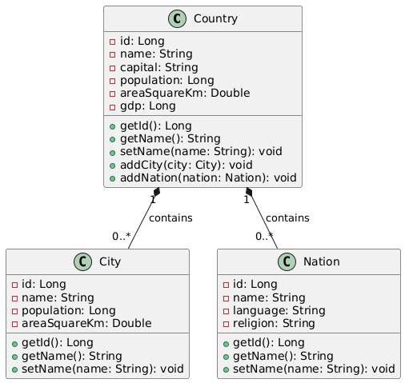

# Диаграмма классов

## Глоссарий

| Понятие     | Описание                                                                 |
|-------------|--------------------------------------------------------------------------|
| **Country** | Класс для страны: поля - идентификатор, название, столица, население, площадь, ВВП; коллекции - список городов, список наций. |
| **City**    | Класс для города: идентификатор, название, население, площадь; связь с идентификатором страны. |
| **Nation**  | Класс для нации: идентификатор, название, язык, религия; связь с идентификатором страны.       |