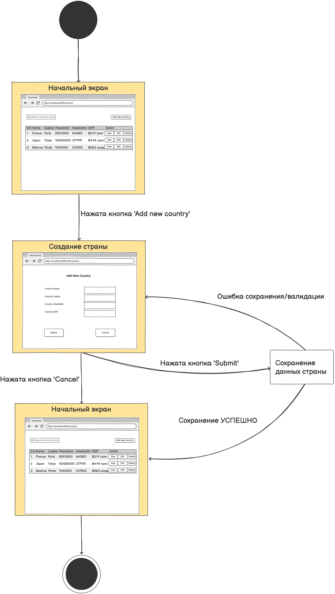
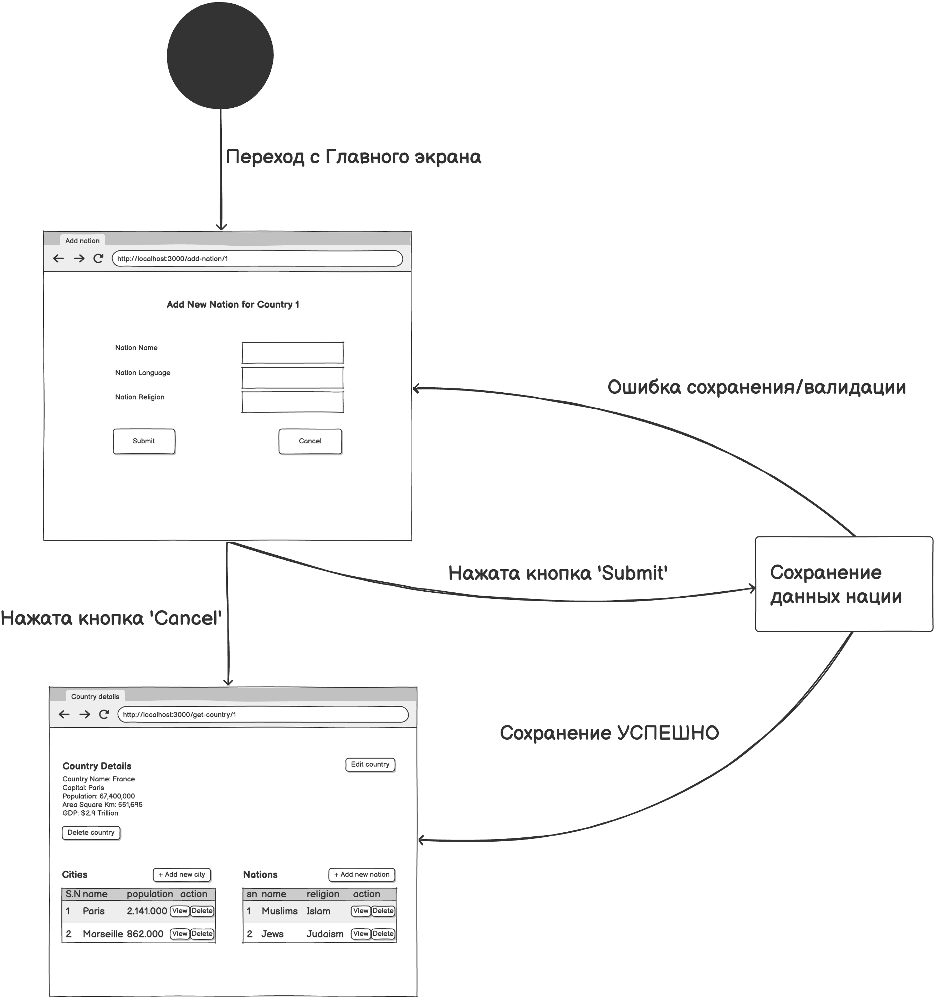

# Диаграмма состояний

# Содержание
1. [Создание страны](#1)
2. [Добавление города к стране](#2)
3. [Добавление нации к стране](#3)

### 1. Создание страны

### 2. Добавление города к стране

### 3. Добавление нации к стране

