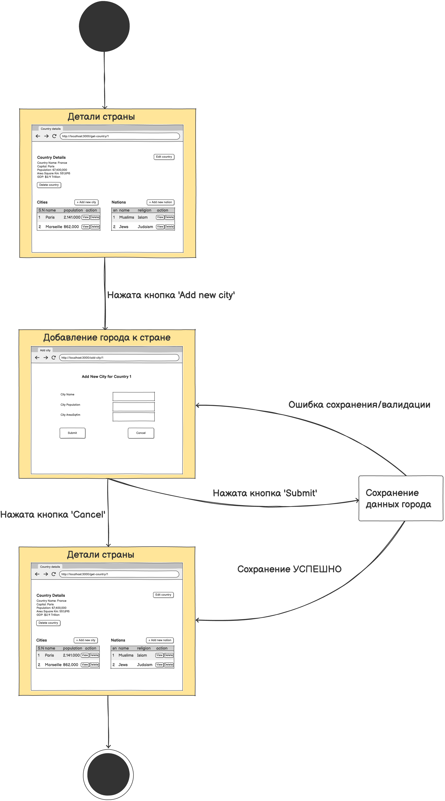
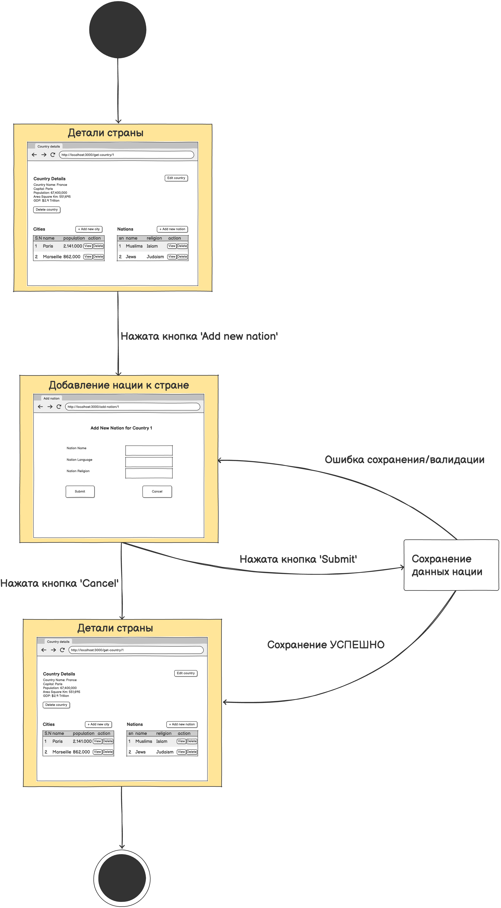

# Диаграмма состояний

# Содержание
1. [Состояние формы редактирования](#1)
2. [Состояние списка](#2)
3. [Состояние деталей страны](#3)

### 1. Состояние формы редактирования

### 2. Состояние списка

### 3. Состояние деталей страны

