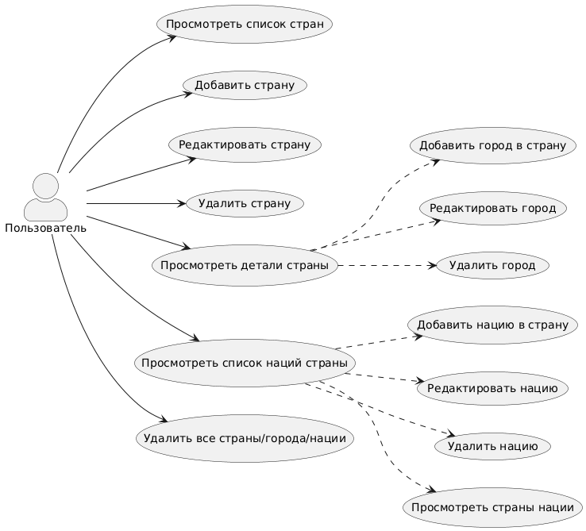

# 📘 Диаграмма вариантов использования — CountrySearch

## 📚 Глоссарий

| Термин          | Определение                                                                 |
|-----------------|-----------------------------------------------------------------------------|
| **Пользователь**| Человек, использующий веб-приложение для управления данными о странах, городах и нациях. |
| **Страна**      | Сущность, представляющая страну с атрибутами: название, столица, население, площадь, ВВП; содержит города и нации. |
| **Город**       | Сущность, принадлежащая стране, с атрибутами: название, население, площадь. |
| **Нация**       | Сущность, принадлежащая стране, с атрибутами: название, язык, религия.     |
| **Список**      | Отображение коллекции стран, городов или наций в табличном виде.           |

---

# 📑 Содержание

1. [Актёры](#1)
2. [Варианты использования](#2)  
   2.1 [Просмотреть список стран](#2.1)  
   2.2 [Добавить страну](#2.2)  
   2.3 [Редактировать страну](#2.3)  
   2.4 [Удалить страну](#2.4)  
   2.5 [Просмотреть детали страны](#2.5)  
   2.6 [Добавить город в страну](#2.6)  
   2.7 [Редактировать город](#2.7)  
   2.8 [Удалить город](#2.8)  
   2.9 [Просмотреть список наций страны](#2.9)  
   2.10 [Добавить нацию в страну](#2.10)  
   2.11 [Редактировать нацию](#2.11)  
   2.12 [Удалить нацию](#2.12)  
   2.13 [Просмотреть страны нации](#2.13)  
   2.14 [Удалить все страны/города/нации](#2.14)

---

## 🎭 1. Актёры

| Актёр          | Описание                                                                    |
|----------------|-----------------------------------------------------------------------------|
| **Пользователь**| Человек, использующий приложение     |

---

## 🎬 2. Варианты использования

### 2.1 Просмотреть список стран

**Описание:** Отображение всех стран в табличном виде.  
**Предусловия:** Пользователь находится на главном экране приложения.

**Основной поток:**
- Пользователь нажимает кнопку "Загрузить список" или открывает главную страницу.
- Приложение запрашивает данные о странах с сервера.
- Отображается таблица с колонками: №, Название, Столица, Население, Площадь, ВВП, Действия.
- Пользователь видит кнопки: "Просмотр", "Редактировать", "Удалить" для каждой строки таблицы.
- Пользователь нажимает кнопку "Добавить страну" для перехода к форме добавления.

**Альтернативный поток А1:**
- Если данных нет, таблица отображается пустой, и появляется сообщение "Нет доступных стран".

---

### 2.2 Добавить страну

**Описание:** Создание новой страны.  
**Предусловия:** Пользователь нажал кнопку "Добавить страну" на главной странице.

**Основной поток:**
- Отображается форма с полями: Название, Столица, Население, Площадь в кв. км, ВВП.
- Пользователь вводит текст в поле "Название", кликает в поле "Столица" и вводит значение, затем заполняет числовые поля "Население", "Площадь в кв. км" и "ВВП".
- Пользователь нажимает кнопку "Сохранить" в нижней части формы.
- Приложение отправляет данные на сервер для создания записи.
- При успехе пользователь видит сообщение "Страна добавлена", и происходит переход обратно на список стран.
- Список стран обновляется, новая строка появляется в таблице.

**Альтернативный поток А2:**
- При нажатии кнопки "Сохранить" система проверяет поля: если какое-то поле пустое или содержит некорректные числа, появляется сообщение "Все поля обязательны" или "Некорректные числовые значения", и пользователь возвращается к заполнению формы.

---

### 2.3 Редактировать страну

**Описание:** Обновление существующей страны.  
**Предусловия:** Пользователь нажал кнопку "Редактировать" в строке таблицы для выбранной страны.

**Основной поток:**
- Приложение запрашивает данные страны по её идентификатору.
- Форма заполняется текущими значениями: пользователь видит предзаполненные поля "Название", "Столица" и т.д.
- Пользователь кликает в нужное поле, например "Название", стирает текст и вводит новое значение, затем редактирует другие поля по необходимости.
- Пользователь нажимает кнопку "Сохранить изменения".
- Приложение отправляет обновлённые данные на сервер.
- При успехе пользователь видит сообщение "Изменения сохранены", и происходит переход на список стран или на экран деталей (если редактирование вызвано из контекста нации).

**Альтернативный поток А3:**
- Пользователь нажимает кнопку "Отмена" в форме, и система возвращает его на предыдущий экран без сохранения.

---

### 2.4 Удалить страну

**Описание:** Удаление страны.  
**Предусловия:** Пользователь нажал кнопку "Удалить" в строке таблицы для выбранной страны.

**Основной поток:**
- Пользователь подтверждает действие, нажав "Да" в диалоговом окне "Удалить страну?".
- Приложение отправляет запрос на удаление данных страны.
- При успехе строка удаляется из таблицы, и список обновляется.

**Альтернативный поток:** Пользователь нажимает "Нет" в диалоге, и ничего не происходит.

---

### 2.5 Просмотреть детали страны

**Описание:** Детальный просмотр страны с городами и нациями.  
**Предусловия:** Пользователь нажал кнопку "Просмотр" в строке таблицы для выбранной страны.

**Основной поток:**
- Приложение запрашивает данные страны, её городов и наций.
- Отображается карточка с информацией о стране: название, столица и другие атрибуты.
- Ниже показывается таблица городов с колонками: №, Название, Население, Площадь, Действия (кнопки "Редактировать", "Удалить").
- Пользователь видит кнопку "Добавить город" в конце таблицы.
- Аналогично отображается таблица наций с колонками: №, Название, Язык, Религия, Действия.
- Пользователь видит кнопку "Добавить нацию" и кнопку "Удалить все города" в верхней части раздела городов.
- Пользователь нажимает кнопку "Вернуться на главную" для выхода.

**Альтернативный поток А4:**
- Если городов или наций нет, таблица отображается пустой с сообщением "Нет доступных городов/наций".

---

### 2.6 Добавить город в страну

**Описание:** Создание города для конкретной страны.  
**Предусловия:** Пользователь находится на экране деталей страны и нажал кнопку "Добавить город".

**Основной поток:**
- Отображается форма с полями: Название, Население, Площадь в кв. км.
- Пользователь вводит текст в поле "Название", затем числовые значения в "Население" и "Площадь в кв. км".
- Пользователь нажимает кнопку "Сохранить".
- Приложение отправляет данные на сервер для создания города в составе страны.
- Происходит переход обратно на экран деталей страны, и новая строка появляется в таблице городов.

**Альтернативный поток А5:** Проверка полей как в 2.2: при нажатии "Сохранить" если поля пустые, пользователь видит сообщение и возвращается к форме.

---

### 2.7 Редактировать город

**Описание:** Обновление города.  
**Предусловия:** Пользователь нажал кнопку "Редактировать" в таблице городов на экране деталей страны.

**Основной поток:**
- Приложение запрашивает данные города.
- Форма заполняется текущими значениями полей.
- Пользователь кликает в поле, например "Население", и вводит новое число.
- Пользователь нажимает кнопку "Сохранить изменения".
- Приложение отправляет обновлённые данные на сервер.
- Происходит переход на экран деталей страны, таблица городов обновляется.

**Альтернативный поток А6:** Пользователь нажимает "Отмена", и возвращается на экран деталей без изменений.

---

### 2.8 Удалить город

**Описание:** Удаление города.  
**Предусловия:** Пользователь нажал кнопку "Удалить" в таблице городов.

**Основной поток:**
- Пользователь подтверждает в диалоге, нажав "Да".
- Приложение отправляет запрос на удаление города.
- Таблица городов обновляется, строка исчезает.

---

### 2.9 Просмотреть список наций страны

**Описание:** Отображение наций в деталях страны (часть 2.5).

**Основной поток:** Как в 2.5: пользователь видит таблицу наций с кнопками действий, нажимает "Добавить нацию" для новой формы.

---

### 2.10 Добавить нацию в страну

**Описание:** Создание нации.  
**Предусловия:** Пользователь нажал кнопку "Добавить нацию" на экране деталей страны.

**Основной поток:**
- Отображается форма с полями: Название, Язык, Религия.
- Пользователь вводит текст в каждое поле по порядку.
- Пользователь нажимает кнопку "Сохранить".
- Приложение отправляет данные на сервер.
- Происходит переход на экран деталей, новая строка в таблице наций.

**Альтернативный поток А7:** Проверка полей: при пустых полях сообщение появляется, пользователь корректирует ввод.

---

### 2.11 Редактировать нацию

**Описание:** Обновление нации.  
**Предусловия:** Пользователь нажал кнопку "Редактировать" в таблице наций.

**Основной поток:**
- Форма заполняется текущими данными.
- Пользователь редактирует поля, кликая и вводя новые значения.
- Нажимает "Сохранить изменения".
- Таблица наций обновляется после возврата.

---

### 2.12 Удалить нацию

**Описание:** Удаление.  
**Основной поток:**
- Пользователь подтверждает удаление в диалоге.
- Приложение отправляет запрос на удаление.
- Строка исчезает из таблицы.

---

### 2.13 Просмотреть страны нации

**Описание:** Список стран для нации.  
**Предусловия:** Пользователь нажал кнопку "Просмотреть страны" в списке наций.

**Основной поток:**
- Приложение запрашивает данные нации и связанных стран.
- Отображается таблица стран с колонками: №, Название, Столица, Население, Площадь, ВВП, Действия.
- Пользователь видит кнопки "Редактировать" для каждой строки.

**Альтернативный поток А8:** Если стран нет, таблица пуста.

---

### 2.14 Удалить все страны/города/нации

**Описание:** Массовое удаление.  
**Предусловия:** Пользователь нажал кнопку "Удалить все" в соответствующем разделе.

**Основной поток:**
- Пользователь подтверждает в диалоге "Удалить все элементы?".
- Приложение отправляет запрос на массовое удаление.
- Таблица или список обновляется, элементы исчезают.
